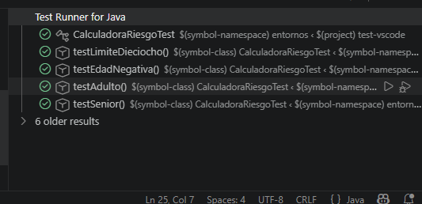

# Práctica: Pruebas Unitarias con JUnit 5 en VS Code

Este proyecto consiste en la configuración de un entorno de desarrollo Java utilizando **Visual Studio Code** y **Maven** para la gestión de pruebas unitarias con **JUnit 5**.

## Herramientas utilizadas
* **IDE:** Visual Studio Code
* **Gestor de proyectos:** Maven
* **Motor de pruebas:** JUnit 5.10.0
* **JDK:** 21 (o su versión correspondiente)

## Descripción de la práctica
Se ha implementado una clase `CalculadoraRiesgo` que categoriza a las personas según su edad:
- Menor de 0 o mayor de 120: **Error**
- Menor de 18: **Joven**
- Hasta 65: **Adulto**
- Más de 65: **Senior**

##  Pruebas Unitarias Realizadas
Se han ejecutado satisfactoriamente los siguientes tests:
1. `testEdadNegativa`: Verifica que edades < 0 devuelven "Error".
2. `testAdulto`: Verifica que 25 años devuelve "Adulto".
3. `testSenior`: Verifica que > 65 años devuelve "Senior".
4. `testLimiteDieciocho`: Verifica que exactamente 18 años devuelve "Adulto".

## 📸 Evidencia de funcionamiento (Test Results)

> Se han utilizado las herramientas de VS Code (Icono del Matraz y Codelens) para la ejecución y depuración de los casos de prueba.
